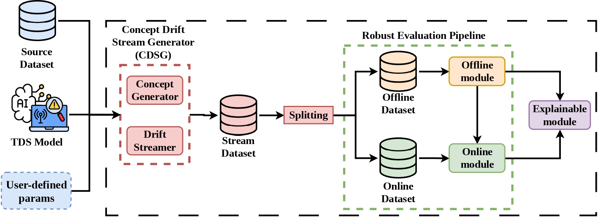
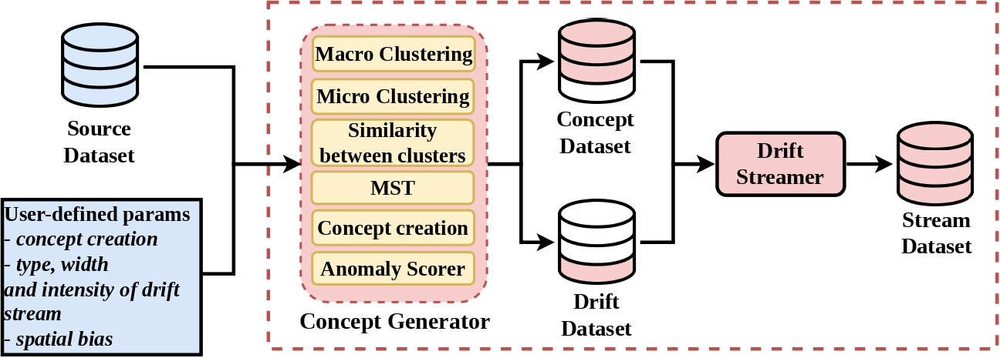
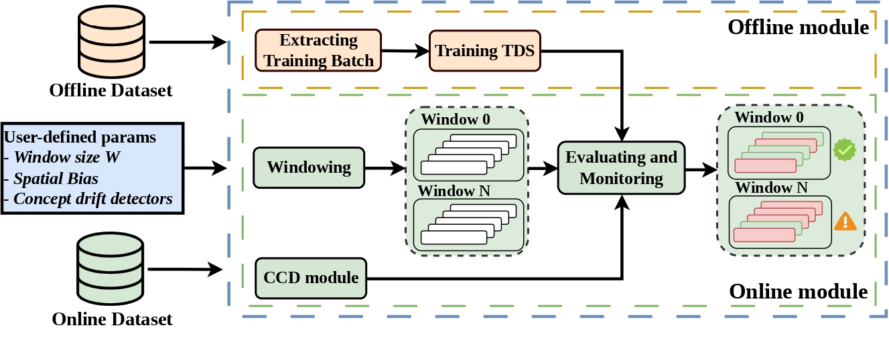

# E-REFINE

This repository contains the implementation of the **Concept Drift Stream Generator (CDSG)** from the **REFINE framework**, available in the [`refine-cdsg`](https://github.com/gabrielecosta/E-REFINE/tree/refine-cdsg) branch.

## Overview

E-REFINE is a modular framework designed to address the challenges of evaluating and understanding the reasoning of machine learning-based threat detection systems (TDSs) under concept drift, by combining realistic stream generation, derived from real-world datasets, with configurable drift characteristics and a robust, reproducible evaluation pipeline. The framework takes three inputs: a source dataset, the ML-based threat detection system to be evaluated, and a set of user-defined parameters governing the experimental setup. The overall architecture of the framework is illustrated in the figure below. 



E-REFINE is composed of three main subsystems:
- **Concept Drift Stream Generator (CDSG)**, which, based on user-defined parameters, generates a dataset exhibiting induced concept drift and spatial bias while avoiding temporal experimental biases. 
- **Robust Evaluation Pipeline**, comprising an *Offline module* for training the threat detection system on static data, and an *Online module* for evaluating its performance on streaming data through fixed-size windows. In addition, the online phase incorporates a set of heterogeneous concept drift detectors within the *Concept Drift Detector module*, used to verify whether the drift induced by the CDSG is consistent with the desired properties.
- **Explainable module**, which tracks the evolution of feature importance over time and quantifies how the explanations of an online ML model deviate from a reference, revealing which features contribute the most to the observed drift.

### Concept Drift Stream Generator (CDSG)




### Robust Evaluation Pipeline




## Repository organization
This repository contains all components necessary for this project. 

| Component | Files/Directory | Purpose |
| :--- | :--- | :--- |
| **Concept Generator** | `concept_generator.py` | Concept generator class (`ConceptGenerator`) implementing the concept-generator logic. |
| **Streamer Generator** | `streamer_generator.py` | Streamer class (`StreamerGen`) implementing Drift Streamer logic. |
| **CDSG** | `cdsg.py` | Main class (`CDSG`) that coordinates and uses both `ConceptGenerator` and `StreamerGen` classes. |
| **Offline module** | `robustevaluationpipeline.py` | Main class (`RobustEvaluationPipelineOffline`) that integrates the `Offline` module. |
| **Online module** | `robustevaluationpipeline_online.py` | Main class (`RobustEvaluationPipelineOnline`) that integrates the `Online` module. |
| **Robust Evaluation Pipeline** | `robust_eval.py` | Main class (`RobustEval`) that coordinates and uses both `Offline` and `Online` modules. |
| **Explainable module** | `explainable_module.py` |Main class (`ExtractXAIOnline`) that extracts explanations for the explainable module. |
| **Datasets** | `datasets/` |This directory contains the input source datasets, which for now should be flow-based datasets. |

Additionally, the following files containes useful informations and examples for use all the components:
- `main_cdsg_use.py`: explanation of parameters; 
- `main_cdsg_examples.py`: examples of use cases for the CDSG module;
- `robust_eval.py`: examples of usage of the Robust Evaluation Pipeline from training to evaluation;
- `explainable_module.py`: examples of usage for the Explainable module for extracting explanations.

---

## Requirements
This project requires Python3.x and the following dependencies.

### Prerequisites
Ensure you have pip (Python package installer) installed.

### Installation
All necessary dependencies can be installed using the `requirements.txt` file. These dependecies can be installed by running the following command in the terminal:
```bash
pip install -r requirements.txt
```

## Citation

If you use this repository in your research, please cite REFINE framework:

```bibtex
@article{Costa20261835,
    author = {Costa, {Gabriele Nicolò} and {De Paola}, Alessandra and Drago, Salvatore and Ferraro, Pierluca and {Lo Re}, Giuseppe},
    title = {{REFINE}: {Robust} {Evaluation} {Framework} for {IDS} under Concept Drift in Dynamic Environments},
    year = {2026},
    journal = {International Conference on Agents and Artificial Intelligence},
    volume = {2},
    pages = {1835--1846},
    doi = {10.5220/0014447100004052},
}
```